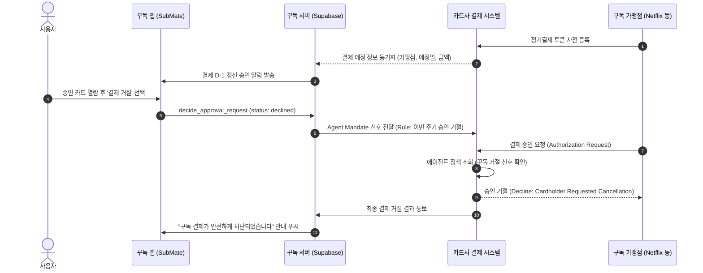

# [제휴 제안서] 카드사 정기결제 직전 승인·차단 에이전트 연동 제안

> 작성: 서브에이전트(Gemini 3.8 Flash) 조사, 메인 에이전트 검토(2026-10-04). (확인 필요) 표시는 링크나 내용을 공식 원문으로 확인하지 못한 항목이다. 수치는 제휴 협의 전 다시 확인한다.

## 결론 요약

1. 꾸독(SubMate)은 구독 결제 D-1 시점에 사용자에게 승인 카드를 노출하고, 거절 시 카드사 결제 엔진에 신호를 전달해 자동 결제를 사전에 차단하는 '구독 승인 에이전트' 제휴를 제안합니다.
2. 꾸독은 결제대금 수취·정산에 관여하지 않고 순수 권한 및 승인 정보 전달자(Mandate Manager) 역할만 수행하므로 전자금융거래법상 PG 등록 의무 발생 가능성을 차단하며, 카드사는 차지백·민원 비용을 줄이고 락인 효과를 얻습니다.
3. 글로벌 네트워크 규격(Visa Intelligent Commerce, Mastercard Agent Pay)과 국내 6개 카드사 에이전틱 레디 실증 체계를 기반으로 1개 카드사 대상 1,000명 규모의 12주 파일럿을 추진합니다.

---

## 1. 글로벌 에이전트 결제 기술 구조 및 파트너 참여 방식

### 1.1 Visa Intelligent Commerce
- **토큰 구조**: 카드 원본 번호(PAN) 대신 에이전트와 특정 가맹점, 거래 조건에 귀속되는 '에이전트 전용 패스스루 결제 토큰(Agent-specific pass-through payment token)'을 발급해 결제를 중개합니다. [Visa Developer Overview](https://developer.visa.com/capabilities/visa-intelligent-commerce/overview)
- **사용자 승인 및 신뢰 프로토콜**: WebAuthn 및 패스키 기반 사용자 인증과 지시사항 일치(Instruction matching)를 검증하며, HTTP Message Signatures 기반의 **Trusted Agent Protocol**을 통해 에이전트의 신원과 권한을 가맹점 및 발급사에 증명합니다. [Visa Trusted Agent Protocol](https://corporate.visa.com/en/sites/visa-perspectives/newsroom/visa-unveils-trusted-agent-protocol-for-ai-commerce.html)
- **파트너 참여 및 생태계**: 2025년 4월 30일 공식 발표 이후 OpenAI, Microsoft, Anthropic, Stripe, Samsung 등과 제휴를 맺었으며, 개발자 포털을 통해 에이전트 등록 및 토큰 관리 API를 제공합니다. [Visa Press Release](https://usa.visa.com/about-visa/newsroom/press-releases.releaseId.21361.html)

### 1.2 Mastercard Agent Pay
- **토큰 구조**: 기존 마스터카드 토큰화 시스템을 확장한 **Mastercard Agentic Tokens**를 사용하여 에이전트가 가상 기업/개인 카드 토큰을 기반으로 거래를 실행하도록 지원합니다. [Mastercard Agent Pay Overview](https://newsroom.mastercard.com/news/press/2025/april/mastercard-unveils-agent-pay-pioneering-agentic-payments-technology-to-power-commerce-in-the-age-of-ai/)
- **통제 및 사용자 권한**: 신뢰받는 에이전트 등록(Trusted-agent registration) 및 사전 검증 절차를 필수로 두며, 사용자가 에이전트의 구매 한도와 카테고리를 통제할 수 있는 권한 관리 인터페이스를 요구합니다. [Mastercard Agent Pay Portal](https://www.mastercard.com/us/en/business/artificial-intelligence/mastercard-agent-pay.html) (확인 필요)
- **파트너 참여 방식**: 공개 API 포털보다는 라이선스 파트너십 및 발급사/대형 핀테크 대상 비공개 실증 프로그램을 중심으로 온보딩을 진행합니다. [Mastercard Machine Payments Release](https://www.mastercard.com/us/en/news-and-trends/press/2026/june/mastercard-launches-agent-pay-for-machines.html) (확인 필요)

---

## 2. 국내 카드사 에이전트 결제 실증 최신 현황

### 2.1 신한카드 × Mastercard 실거래 실증
- 신한카드는 2026년 3월 30일 Mastercard의 Agent Pay 인프라를 활용하여 국내 카드업계 최초로 이동수단 검색, 예약, 결제까지 한 번에 완료하는 **AI Agent Pay 실거래**를 완료했습니다. [신한금융그룹 보도자료](https://www.shinhangroup.com/kr/archive/press/detail/692)
- 신한카드는 인증·권한 관리와 결제 프로세스 연동 시스템을 담당하고, 사용자는 최종 결제 단계에서 단 1회의 인증만 수행하도록 설계했습니다. [Mastercard AP Press Release](https://newsroom.mastercard.com/news/ap/en/newsroom/press-releases/en/2026/mastercard-completes-korea-s-first-live-agentic-transactions-unlocking-trusted-ai-powered-commerce/)

### 2.2 Visa Korea ‘에이전틱 레디(Visa Agentic Ready)’ 프로그램
- 비자코리아는 2025년 11월 LG U+ ixi-O 파일럿에 이어, 2026년 4월 30일 **KB국민카드, 삼성카드, 신한카드, 카카오뱅크, 하나카드, 현대카드** 등 국내 6개 발급사와 함께 아태지역 ‘비자 에이전틱 레디’ 프로그램을 공식 출범했습니다. [Visa Korea 2025-11 보도자료](https://www.visakorea.com/about-visa/newsroom/press-releases/nr-kr-251125.html), [Visa Korea 2026-04 보도자료](https://www.visakorea.com/about-visa/newsroom/press-releases/nr-kr-260430.html)
- 통제된 샌드박스 환경에서 AI 에이전트 결제 시 발생할 수 있는 토큰화 유효성, 부정결제 리스크, 소비자 인증 프로세스를 공동 검증하고 있습니다.

---

## 3. 카드사 기존 '정기결제 차단/해지' 서비스 공식 현황 및 한계

### 3.1 어카운트인포(AccountINFO) 카드자동납부 통합관리
- 금융결제원 및 여신금융협회가 운영하는 페이인포(어카운트인포)의 '카드자동납부 통합관리' 서비스를 통해 소비자는 카드사에 등록된 자동납부 내역을 조회하고 해지할 수 있습니다. [금융결제원 페이인포](https://www.payinfo.or.kr)
- **한계점**:
  1. 서비스 이용 시간이 영업일 09:00~22:00로 제한됩니다.
  2. 통신비, 아파트관리비, 4대보험, 도시가스, 렌탈료 등 공과금 성격의 지로형 가맹점에 집중되어 있습니다.
  3. 넷플릭스, 유튜브, 쿠팡, OpenAI 등 해외 가맹점 및 일반 전자상거래 빌링키 기반 구독은 조회가 불가능하거나 목록에 보이지 않을 수 있습니다(확인 필요).

### 3.2 개별 카드사 앱 자동납부 해지 기능
- 삼성카드, 신한카드 등 주요 카드사 앱에서 개별 등록된 생활요금 자동납부 가맹점을 확인하고 해지 신청을 할 수 있으나, 신청 후 가맹점 통보까지 수일이 소요되거나 결제 승인 요청 자체를 즉시 거절하는 규칙(Rule) 사전 설정이 불가능합니다. [삼성카드 정기결제 안내](https://www.samsungcard.com/personal/services/rglr-stlm/UHPPPS2001M0.jsp)

---

## 4. 법적 쟁점 검토

### 4.1 전자금융거래법상 PG(전자지급결제대행업) 등록 대상 여부
- 금융위원회는 등록 PG가 대금을 수취·정산하고 플랫폼은 정산에 필요한 정보만 전달하는 구조라면 플랫폼은 PG 등록이 필요 없다고 설명합니다. [금융위원회 보도설명자료](https://www.fsc.go.kr/no010102/82523)
- 그러나 대법원은 정보 송수신뿐 아니라 정산 대행·매개도 PG 업무로 보며, 다른 PG가 송금 일부를 맡더라도 자금 흐름에 실질적으로 관여하면 예외를 인정하지 않을 수 있다고 판단했습니다. [대법원 2016도2649 판결](https://www.law.go.kr/precInfoP.do?precSeq=199847)
- **설계 원칙 및 대응**: 꾸독은 어느 단계에서도 결제 금액 결정, 송금·지급 지시, 환불·차감 처리를 하지 않고 승인 화면과 권한 범위(Mandate) 관리만 맡아 자금 흐름에 일절 관여하지 않습니다. 3단계 착수 전 실제 결제 흐름도를 첨부해 금융당국 법령해석 또는 비조치의견서로 등록 의무 여부를 최종 확인합니다.

### 4.2 비조치의견서 및 혁신금융서비스 신청 절차
- **비조치의견서(No-Action Letter)**: 금융규제민원포털을 통해 서비스 플로우와 결제대금 비관여 사실을 명시하여 사전에 법적 제재 대상이 아님을 공식 확인받습니다. [금융규제민원포털](https://better.fsc.go.kr)
- **혁신금융서비스(규제 샌드박스)**: 금융혁신지원특별법에 따라 '소비자 주도형 정기결제 사전 차단 에이전트'로 지정 신청하여 카드사와의 특례 제휴를 안전하게 보호받습니다. [금융위원회 혁신금융서비스](https://innovativefinancial.fsc.go.kr) (확인 필요)

---

## 5. 꾸독 × 카드사 제휴 제안

### 5.1 카드사가 얻는 이점
1. **차지백(Chargeback) 및 분쟁 처리 비용 획기적 절감**: 해외 구독 결제 차지백 신청(Mastercard 기준 정산일로부터 120일) 급증에 따른 카드사 해외이용 이의제기 및 조사 비용을 절감합니다. [Mastercard Chargeback Guide](https://www.mastercard.com/content/dam/mccom/shared/business/support/rules-pdfs/chargeback-guide.pdf)
2. **다크패턴 규제 선제 대응**: 개정 전자상거래법(2025-02-14 시행)에 따른 자동 유료 전환·인상 시 소비자 명시 동의 규제 위반 민원을 사전 차단합니다. [공정거래위원회 다크패턴 가이드라인](https://www.ftc.go.kr/www/selectBbsNttView.do?bordCd=3&key=12&nttSn=43802&pageIndex=1&pageUnit=10&rltnNttSn=43802&searchCnd=all&searchViolt=000002)
3. **AI 에이전트 결제 주도권 선점**: 비자 Agentic Ready 및 마스터카드 Agent Pay 실증을 상용 서비스 수준의 고객 접점(B2C)으로 전환합니다.

### 5.2 꾸독이 제공하는 핵심 가치
- 결제 D-1 직전 승인 UI/UX 및 생체인증 기반 권한 관리(Mandate Management).
- 가맹점별 요금 인상 및 유료 전환 감지 알림.
- 결제대금 수수 및 보관 완전 배제(순수 승인/거절 신호 전달).

### 5.3 기술 연동 흐름 (Sequence Diagram)

### 5.4 파일럿 범위 및 KPI (목표/가정)
- **대상**: 제휴 카드사 회원 중 구독 서비스 3개 이상 이용자 1,000명.
- **기간**: 12주 (준비 4주, 운영 8주).
- **핵심 KPI (목표/가정)**:
  - D-1 승인 카드 확인율: 60% 이상 달성 (목표/가정).
  - 원치 않는 결제 사전 거절 성공률: 99.9% (목표/가정).
  - 카드사 고객센터 구독 관련 민원·차지백 발생률: 40% 감소 (목표/가정).

### 5.5 추진 일정
- **1~2주차**: 비조치의견서 신청 및 API 규격 합의 (Trusted Agent Protocol 기반).
- **3~4주차**: 샌드박스 망 연동 및 토큰 정책 테스트.
- **5~10주차**: 1,000명 클로즈드 베타 파일럿 운영.
- **11~12주차**: 성과 평가 및 본 상용 서비스 전환 협약.
